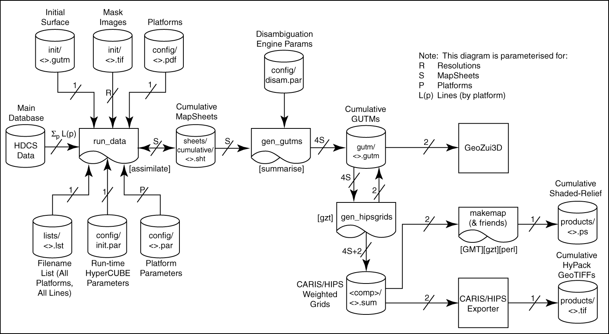

# Development Notes: the CCOM Implementation of CUBE

1 February 2003

## Introduction

This document describes the implementation of the CUBE algorithm developed at the Center for Coastal and Ocean Mapping & Joint Hydrographic Center at the University of New Hampshire.  This test implementation, known as libccom, has been used during development of the algorithm, and is provided to all members of the CCOM-JHC Industrial Consortium who have also signed a software license agreement allowing them to implement CUBE.

The code has been constructed with an eye to efficiency and processing time, but has not been heavily optimized.  In many cases, choices that made the code simpler to modify or more flexible have been made, to the detriment of execution speed.  The code was developed in a research environment, and it is likely that any commercial implementation would not make the same choices, and would benefit (possibly significantly) from re-thinking the implementation of the same basic algorithm.  The code was initially developed on a Unix system, and then ported to Win32.  Where appropriate, WIN32 is used as a pre-processor macro to identify regions that are specific to one system or the other (typically the use of primitives to get at directory information).  The code is written exclusively in ANSI C, although the header files are appropriately wrapped to avoid name-mangling problems when dealing with C++.  The code has been compiled, as is known to work, on IRIX, Linux and Win32 (2000 and XP), although it has most intensively, and most recently, been used, developed and tested on the Win32 platform.

This document is not intended to be a description of the philosophy, principles or background to CUBE, which are covered in the published papers on the subject.  It does not describe the mathematics of the algorithm, nor does it describe the details of every section of the library in equal measure.  It is intended to provide an overview of ‘what goes where’ in the codebase in order to aid developers in investigation, adaptation and integration into their own products.  Wherever the code disagrees with the document, the code should be preferred.  It would probably be useful to read this document with reference to the particular code module being described; the code usually has a comment block at the start of every function defining the input and output parameters, expectations of the code and any side-effects or caveats that are appropriate.  The CVS commit headers at the start of each file also list the modifications made to the code since the first version, and often cover the intentions behind the modifications, rather than the specifics.

The distribution of the library is maintained in a CVS repository at CCOM, including this document and the published papers on CUBE and related topics.  The CVS repository is a living document, and modifications, corrections and enhancements may be made from time to time as detailed in the software license agreement that covers CUBE.  Developers are granted read-only access to the repository at the time of their entry into the agreement, and should use it to maintain their codebase.

## Nomenclature and Source File Locations

The source code is organized in modules.  Each modules attempts to define one particular service for the library, with minimal cross-talk between modules.  The source files in each module are prefixed by the module name, which is intended to be descriptive of the module’s task.  So the sounding module is implemented in the sounding directory, with primary files sounding.c/.h, and has all functions prefixed sounding_…(); this module deals with obtaining soundings from any number of sources, and translating and processing them so that they appear to the rest of the system in a uniform fashion.  The mapsheet module deals with services in a layered geo-referenced 2D system, projection deals with conversion from geographic to projected coordinate systems, etc.  Each module attempts to expose as little of the internal workings as possible including internal data structures, most of which are ‘opaqued’ so that callers only see a pointer to structure rather than the implementation of the structure.  In this way modules are designed with similar intent to object classes.  In each module, the primary header file defines the public interface to the module.  Where required there are sub-modules, prefixed with the module name (e.g., mapsheet_cube.c for specific handling of a CUBE layer), which may have associated headers.  These are usually not available for use external to the module.  In some cases, there is also a <module>_private.h, defining types used throughout the module.

Base types are handled through a single file, stdtypes.h, in the ccom module.  This redefines base types in terms of class and length, so u32 is an unsigned 32-bit integer, f64 is a double (64-bit float), etc.  This module also defined Bool, which may cause namespace clashes elsewhere.

## Sounding Ingestion

Soundings are dealt with through the sounding class, intended to abstract the details of obtaining soundings from a particular source so that a call to sounding_get_next() returns the data for the next ping, complete with attitude information for the survey platform (in a Platform structure, defined in sounding.h), and the pings themselves as an array of Sounding structures (also defined in sounding.h).  The sounding module currently deals with GSF files, HIPS/HDCS projects, UNB OMG .merged files, some manufacturer’s internal data formats, a native (pre-digested) format, and a plain (raw x,y,z) format.  Of these, only the GSF, HDCS, OMG and Raw formats can be used for initial error attribution.  The native format is constructed from these (and is the only format that the module can write), and hence is already error attributed, and the plain format does not provide enough information on the platform and soundings to generate realistic error bounds.

The GSF format is interpreted via the SAIC libgsf.lib object called through sounding_gsf.c.  Both single and dual-headed files are supported and have been tested.  The module has to make a number of assumptions about the data file in order to generate the information required for error modeling, in particular about the surface speed of sound at the transducer during the ping, and the water column structure of the data.  The defaults that are used are defined in the system-wide parameters file (see section on Parameter Handling).

The HDCS structure is interpreted via the CARIS HDCS library, called through sounding_hips.c.  Again both single and dual head structures are allowed, although specification of offsets, etc. is done through the libccom Vessel description, rather than through the CARIS VCF.  This is because the offsets in the VCF are residual offsets that need to be applied to the data, which in some cases may be zeroed (e.g., Simrad systems, where all of the computation is done in the Simrad top-side processor).  The error model requires the actual offsets between transducer, IMU and GPS, not just those that still need to be applied.  The code also has to fake a number of parameters for the error model because they are not available in the public interface of the library.  In particular, it has to attempt to compute the approximate number of samples that were present in the footprint of each beam in order to determine whether it was probably detected using phase or amplitude methods (where they exist on the particular sonar).  It also has to fake sound speed properties at the transducer, and in the water column.  Most importantly, it has to interpolate its own attitude information from the component files, based on the timestamp associated with the ping itself.  This is done via the interp module, using linear interpolation in time.

The OMG module (sounding_omg.c) has been tested extensively for reading, but rarely for error attribution.  Whether error attribution works reliably is unknown.  Similar approximations as above are required to fill in all of the information required for the error model.

Raw manufacturer’s datagrams are currently limited to Simrad systems, implemented in sounding_raw.c, which calls read_simrad.c to manage and translate the Simrad datagrams into something useful, and in turn calls simrad.c to do the actual reading.  The code in simrad.c is generated automatically using the text file description in simrad.bfd and bfreader, an auxiliary project developed at CCOM for this purpose.  Reading from raw is currently limited to Simrad systems solely because they provide resolved soundings, rather than raw range/angle measurements (like, e.g., Reson systems).  Because many good solutions to the refraction and body-frame computations exist, we have chosen not to pursue incorporating one in the library; we assume that this problem can be resolved elsewhere.  The raw file reader can re-synchronise files, and ensures that data is available for navigation and attitude interpolation before bathymetric data is returned to the caller.

Soundings are organized into logical streams, represented by a SoundingStream structure.  The life-span of a SoundingStream is to be constructed using sounding_new_from() or sounding_new_from_dual(), which requires a filename, file-type, and information on the sonar device which generated the data, and the vessel on which it was mounted (see next section).  The soundings can then be read by sounding_get_next(), which returns a ping on each call until there is an error, or the end of the file is reached.  If more data from the current system is available, the stream may be re-aligned by calling sounding_attach_file(), which closes the previous file and starts reading from a new one.  Finally, the sounding stream may be removed by calling sounding_release().

It is unlikely that the sounding module will be used by companies implementing the CUBE algorithm, since they are likely to have their own implementation of similar ideas.  However, the implementation within the sounding module of how to deal with Device and Vessel structures, and generating, testing and evaluating error models will probably be of interest.  Of course, the sounding module can also be used to check a commercial implementation of the attribution of errors.  If the sounding module is replaced, the information content must also be replaced.  Particularly, the information implicit in the flags variable in the Sounding structure must be available through other means, since it is critical to the error model computations.  Currently, this is an u32, with the LSB indicating the type of bottom detection (i.e., phase or amplitude; set implies phase), and the next eight bits indicating the number of samples in the beam footprint (which impacts the error model when phase detection is being used), limited above at 255 samples.  The next eight bits are used for vendor flags, which may or may not be implemented.  See the macro definitions at the start of sounding.c for full details of the locations and definitions.

## Devices and Vessels

The error model used in CUBE depends strongly on the very particular properties of the sonar device that generated the data, and the vessel on which it was mounted (including the auxiliary sensors used for measurement of position and attitude).  The combination of these is referred to as a ‘survey platform’ in the code and this document.

The device module encapsulates aspects of various sonar devices that are important for the model, and for general information about sonar systems (e.g., the number of beams, primary frequency, opening angle, etc.) that is useful for configuration of code modules.  This is implemented as a simple flat-file database that can be queried using an ID number encapsulated in a Device structure.  A new Device structure can be built using a keyname (e.g., ‘em3000’ for a Simrad EM3000, ‘sb8101’ for a Reson SeaBat 8101), or via an enum value that specifies the sonar directly.  The device module also provides code to compute pointing angles for a system given the beam number and other parameters (device_beam_to_angle()), and the proportion of error associated with the performance of the sonar system itself (in the absence of other effects such as refraction, positioning, etc.), in range (device_compute_rangeerr()) and angle (device_compute_angerr()).  The information in this module has been derived from a number of sources, including the original Hare et al. report, the Dutch MEET version of the model, manufacturer’s documentation and anecdotal evidence from manufacturers.

The vessel module acts in much the same was as a CARIS VCF, except that it is extended to support the parameters required for error modeling, particularly the accuracy of the various measurements used in computing the soundings.  The module consists of a number of routines to read and write a Vessel structure (vessel.h) from and to disc.  The structure is defined directly in the header file in this case, rather than being opaqued, because it is used heavily in the rest of the code.  It would take too long in inner loops to go through a call interface in order to get at the data structure.  The Vessel structure can be written in binary form, and read in either binary or ASCII.  The ASCII form is the same as that used for configuring the rest of the library, and is described in the section on Parameter Handling below.  The extended format for dual-headed systems and examples of particular vessels are also described below.  It is possible for the Vessel description to contain a text string declaring the type of sonar being used.  This is converted and stored internally as a DeviceType enum, and device_new_from_type() may be used to convert it into a form useful with the rest of the library.  Consequently, a single text file can contain all of the information required to fully define a survey platform.  Note that systems that have split-head sonar implementations (e.g., Elak-Nautik 1180 MBES) are represented internally as dual-head, even if the information is integrated by the sonar capture system.  This is because the error model requires information on the offsets and patch-test results to compute errors, and there are two sets to consider in this case.  The same is also true of dual-headed systems that report their information in a unified format (e.g., EM3000D) and ‘true’ dual-headed systems (e.g., SeaBat 8125 in slave mode).  Specification of both heads is identical, and the heads inherit the overall specification in the file, if available, before any modifications are made from the particular specification.

The use of a completely general file to describe very detailed information about measurement accuracies of the auxiliary sensors is probably not particularly useful in a production environment.  It might be better to allow the user to select the sensors by name, and have the code fill in the rest of the information from an internal database, in a similar way to the device module above.  Users of the vessel module should note that the Vessel structure returned by any call is a reflection of the current state of the module, and is not guaranteed for any length of time.  In particular, loading a library-wide configuration parameter file might result in the internal structure changing, and users should call vessel_get_head() immediately after loading the description via vessel_new_from_file() or vessel_execute_params() (for binary or ASCII mode), and cache the returned Vessel structure themselves.

## Error Attribution

The base of the CUBE algorithm is estimation of the errors associated with soundings, and their use in processing.  The error attribution code is implemented in the errmod module.  This module has a core in errmod.c, and two alternative models: a simple one based on IHO S.44 (4th edition) implemented in errmod_iho.c, and the full Hare et al. error model implemented in errmod_full.c.  The IHO based error model has been only lightly tested as a stopgap before the full error model was properly implemented, and has not been exercised for some time.  The model is simple, but should be operational.  Its use is limited by the crude assumption about error structure that it makes (essentially that error is not dependent on anything except depth), and it should only be used as a last resort.

The error model requires a Device and Vessel pair to be initialized, and has to be configured for a particular order of IHO survey, as specified in IHO S.44; due to a historical circumstance, the orders as identified as 1-4, rather than Special Order, and 1-3.  The correspondence should be understood throughout the code.  Once the platform specification is available, errmod_new(…, ERRMOD_FULL) can be used to construct the model; the ErrMod pointer returned is then used as a key for all further transactions.  Note that the error model preserves the pointers for the Device and Vessel structures, and requires them throughout its lifetime.  However, it does not copy the information, and the structures must be preserved by the caller.

The error model is designed to operate on one ping of the MBES at a time.  This is the maximal quantum, since there are required operations that can only be done at ping time, but each beam must be treated separately.  If required, the per-ping computations could be done once and cached, but this is not currently implemented.  The model requires a Platform structure detailing the attitude and position of the survey platform at the time of the ping, and an array of one or more Sounding structures, describing the location, depth, slant range, and flags for the data to be processed.  Once available, errmod_evaluate() may be used to construct horizontal and vertical error estimates, which are written into the dr and dz elements of the Sounding structure, respectively.  All internal storage and computation of error is done using variances; conversion to standard deviation or scaled standard deviation (for confidence intervals) is done at output only.  Note that depths are positive down (i.e., true depths) for the error model computation, but are positive up (i.e., heights) everywhere else in the library.  The sign reversal implicit in this must be implemented external to the error model, which assumes the positive down convention.

In libccom, the error attribution is done within the sounding module; see sounding_construct_ error_model_specific() for details of error model construction.  For some systems, attribution is done at the sounding.c level but for most (including GSF and HDCS) it is done at the sub-module level.  See sounding_gsf_get_next() or sounding_hips_get_next() for information on evaluation.

Dual-head configurations are not differentiated by the errmod module, since the computation is identical for each head, given the different offsets contained in the Vessel configurations for each head.  It is the user’s responsibility to construct a pair of error models, use the appropriate one for each head, and determine that the number of heads defined by the Device, and available in the SoundingStream’s source are appropriate.  This can be tricky when the soundings are reported in one batch for both heads, since it is not always immediately clear which soundings are associated with which head.  An example of how to deal with this can be found in sounding_hips_get_next(), in sounding_hips.c.

## MapSheets, CubeGrids and CubeNodes

After the soundings are loaded, corrected and error attributed, they are sent to the CUBE algorithm for processing.  The central element agglomerating all of the information required to allow this is the MapSheet, implemented in the mapsheet module via mapsheet.c and its component sub-modules, in particular mapsheet_cube.c.  A MapSheet is an attempt to allow a number of elements that might be of interest to co-exist with a shared interface and common services.  It must contain a method of projection of data from geographic coordinates, bounds of reference, a single fixed resolution of representation, and a count of the number of nodes that this implies within the bounds.  It may also contain one or more layers of information, representing for example an estimate of depth by a number of different algorithms, the sounding density in the area, and so on.  A MapSheet is maintained on disc as a directory containing a number of individual files representing particular components (e.g., one to identify the directory, one containing information on the projection parameters and bounds, one containing parameters for the depth estimation algorithms, one or more containing the actual data, etc.)

The CUBE algorithm is implemented in three layers, representing global, regional and local stages of the algorithm.  The global stage is implemented in the depth layer of a MapSheet using mapsheet_cube.c.  The regional stage is implemented using a CubeGrid, which corresponds to a single contiguous region of estimation (from cube_grid.c/h).  The local stage is implemented by a CubeNode, which represents a single estimation node, i.e., an estimate of depth at a single point location (cube_node.c/h).  This arrangement is intended to make incorporation of the algorithm in different products a simpler process.  The basic algorithm is implemented in a CubeNode; a collection of these to fill a particular region can be implemented by a freestanding CubeGrid; a collection of these can be used to tile an arbitrarily large space through a HyperCUBE super-grid implemented in a mapsheet_cube.c controlled depth layer.  A particular implementation can choose where in this hierarchy to interface.

MapSheets (or sheets) may be created directly using the mapsheet_new_…() set of routines.  Although sheets are always represented internally in projected coordinates, they can be created by bounds or width/height and center in either projected or geographic coordinates; sheets are always defined with respect to the project coordinate grid, and are always north up.  A sheet is defined in terms of estimation nodes, and positions are always with reference to the exact position of the node.  That is, the west bound of the sheet (returned by mapsheet_get_tl() for northwest corner) is the position of the west-most node in the sheet.  The center of a sheet must always be defined on a node, and sheets always have an odd number of nodes in each direction to make this possible while still balancing the sheet.  Internally, sheets are represented by a matrix of data that is arranged in row-major order, running from west to east within a row, and north to south within the sheet.  MapSheets are constructed without any active data layers; a depth estimation surface may be added by calling mapsheet_add_depth_surface().  Adding a HyperCUBE surface automatically creates the appropriate CubeGrid and CubeNode structures.  The surface may be initialized using mapsheet_add_depth_unct(), although this is only used to fixed the ‘predicted’ surface depth and uncertainty in HyperCUBE, which is used for slope correction, and potentially for dynamic depth gates.  An initialization surface is optional, with the facilities automatically being turned off if it does not exist.

## Data Assimilation

Once constructed, data may be added to a MapSheet using the mapsheet_add_soundings() call.  This sends the soundings to whichever depth surface exists, and returns a count of the number that were used in addition to an error code.  This count may be used to determine which data streams are active in which sheets.  In HyperCUBE, the soundings are passed to mapsheet_cube_insert_depths(), which has the principal task of ensuring that the appropriate CubeGrids are in place before passing the data to cube_grid_insert_depths() for each affected CubeGrid.  The code in mapsheet_cube.c arranges for at most four CubeGrids to be active in memory at once, and manages a cache of the CubeGrids using a weighted least-recently used algorithm.  The CubeGrids not being used are written to backing store as elements of the MapSheet directory.  The code in cube_grid.c provides the soundings to appropriate CubeNode structures within the neighbourhood of the sounding’s nominal location, and the code in cube_node.c does the final assimilation of the data with the current state of knowledge about the depths in the survey area to update estimates.

## Data Extraction

Once all of the data has been added to the MapSheet, the mapsheet_get_data() function may be used to extract one of the constructed surfaces.  CUBE constructs four surfaces: depth, uncertainty, number of hypotheses, and hypothesis strength.  Which surface is extracted is defined by the MapSheetElem enum value passed to the call.  This routine generates an appropriately sized data buffer internally, and returns a pointer to it for the user; if the user already has such a buffer, mapsheet_get_data_user() may be used instead to avoid the memory allocation overhead.  No checks are made to ensure that the data buffer is appropriately sized, and side effects up to and including a segmentation fault may occur if it is not.  Surfaces are generated in the same orientation as they are stored internally (i.e., west to east, north to south, row-major matrices).

Extracting a surface from CUBE entails a run of the disambiguation engine, and hence may take a significant amount of time (it also has to load each CubeGrid from disc in turn, which may be non-trivial).  However, all of the surfaces are generated simultaneously.  Therefore, it may be appropriate to use mapsheet_get_all_data(), which extracts all available information and returns appropriate pointers in a MapDataBuffer structure.  The only downfall of this method is that it may consume a large amount of memory transiently if the MapSheet is very large.

The CUBE algorithm contains, at the front-end of the CubeNode level, a queue that buffers soundings in median sorted order before they go to the estimator proper.  This creates a lag between data arriving at the CubeNode and being ‘seen’.  Only data that has made it through to the estimator is reported by the data extraction methods described above.  Consequently, CubeNodes with very little data may report no hypotheses when interrogated, even though some soundings have been provided.  To get round this problem, a mechanism to flush the queues is provided via a call to mapsheet_finalise().  This instructs the CUBE algorithm to flush queues before reporting any data, ensuring that all data is seen by the estimator before making a decision.  Note, however, that this should only be done when a final decision is made, and not during assimilation.  This is because flushing the queue and then adding more data will not have the same effect as adding all of the data, and then flushing the queue (although typically the difference is small).  A special exception to this has been implemented: when a queue is flushed, no record is made of it in the cache flags, so that the code in mapsheet_cube.c assumes that the CubeGrid is clean, and does not need to be written back to disc when it is removed from memory.  Hence, if the MapSheet is resident on disc, it may be safely loaded, flushed, extracted and removed without changing the state on the disc.  In this way, a set of surfaces may be extracted during assimilation without affecting the overall process.  This technique should obviously be used with caution.

## Hypothesis Manipulation

It is occasionally important to work at the level of the hypothesis generated by the CUBE algorithm.  It is possible to use these as an alternative to processing soundings, although with some restrictions.  The interfaces currently defined allow the user to query a node for all of the hypotheses that it contains, to nominate a particular hypothesis for reconstruction, over-riding the algorithm’s automatic choice, and to remove a hypothesis from consideration immediately (and permanently).  All of these are defined in mapsheet.h, and are implemented through all of the levels of the library described above down to the cube_node.c level.

Extraction of a hypothesis can be done by the mapsheet_get_hypo_by_node() or mapsheet_get_ hypo_by_location().  The former uses the absolute reference for the node in rows/columns from the northwest corner of the MapSheet; the latter uses a projected coordinate location, returning the information for the closest node to the position given.  This pattern of call suffices is repeated for all of the hypothesis manipulation calls at the mapsheet.h level.  The hypotheses are returned as a HypoArray structure (mapsheet.h), which contains overall information about the node, and then a linear array of the hypotheses themselves as Hypo structures.  The HypoArray can stand by itself after extraction, since it contains an absolute projected coordinate location for the node, and is used for removal and nomination to reference the hypotheses required. Note that there is no determination in the output as to which depth would be reported, since this will depend on the disambiguation algorithm chosen. To determine the hypothesis that was chosen by the algorithm in the last reconstruction, first check that whether there was a user hypothesis nomination.  If ha->nominated >= 0, then there was a nomination, and the value of nominated indicates which element of the array to choose.  If not, then determine the depth that was reconstructed (i.e., from CUBE’s surface) and call mapsheet_match_hypothesis(depth, ha);   The return value is the index into the array at which this depth is matched.  Match in this case means the hypothesis that minimizes the absolute difference between its current estimate of depth and the depth passed in, within a tolerance of 1mm.
Removal of a hypothesis is controlled through the mapsheet_remove_hypo_x() pair, and the hypothesis to remove is specified by its depth.  The algorithm will only remove the hypothesis if there is a unique match to the depth passed, and that match is within HYP_SELECTION_TOLERANCE (currently 0.01m).  If not, an appropriate error is output, and the routine returns False.  Checks as above for an active surface, etc. are also made.

You should note that removal of a hypothesis is immediate and irreversible.  It is also reflected in the disc cache through flag control at the mapsheet_cube.c level.

Nomination allows a user to specify a particular hypothesis for reconstruction, over-riding the algorithm’s automatic choice.  This can be done to preserve hypotheses but still force a particular choice.  You should note that nomination is transient in the sense that adding data to a node will almost certainly change the hypotheses present there, and may change the order of importance of the hypotheses at the node.  Consequently, a nominated node might not be the most useful after new evidence has been used, and the code currently undoes any nomination when new data is added.  If the nominated hypothesis is removed, the nomination is automatically released.  Nomination is, however, preserved during cycles to disc.

Nomination is controlled through mapsheet_nominate_hypo_x().  The depth supplied to identify the hypothesis needs to be within HYP_SELECTION_TOLERANCE, but the algorithm will automatically choose the hypothesis that minimizes the absolute difference between the supplied depth and the current estimates if there is more than one hypothesis that satisfies the limit.  It is very unlikely that this will happen, since any very close data will probably be assimilated into one hypothesis, rather than spawning a second.  In practice, we tend to see separation of about 0.30m between multiple hypotheses.  Nomination can be reversed, returning control to the algorithm, by use of the mapsheet_unnominate_hypo_x().  No parameters other than location are required.

## Auxilliary Systems

### Projection

The projection module is used to convert to and from geographic coordinates.  Currently, three projection methods are provided: Mercator, UTM and Polar Stereographic; only the WGS-84 ellipsoid is currently defined.  All computations in libccom are carried out in projected coordinates.  Although much of the library assumes only that the system is uniform in both dimensions, the CUBE code also requires that the units used are meters.  The UTM transforms have been tested most extensively, although Mercator projection is known to work; Polar Stereographic mode has only been lightly tested.

The module generates a Projection structure to contain all of the information implicit in the projection process; these are generated with projection_new_x(), and may be utilized through projection_ll_to_en_deg() or projection_en_to_ll_deg() for forward and reverse projection of data.  An interface for spherical coordinates in radians is available by substituting ‘rad’ for ‘deg’ in the above calls.

The projection module is a wrapper around the GCTPC package developed and maintained by the USGS.  Most of the routines are based on Snyder’s classical works.  In UTM mode, the module needs the central latitude and longitude of the area, but uses them only to compute whether to do the computation in the north or south hemisphere (based on sign) and which UTM zone to use, respectively.  In Mercator mode, the central longitude forms the central meridian, while the central latitude forms the latitude of true scale.  In most cases, setting the values to the center of the work area is probably appropriate.

Note that the GCTPC support code has internal statics as is therefore not re-entrant.  More importantly, if you have multiple projection methods of the same type active simultaneously, it is possible that, at any particular time, the current parameters in GCTPC will not be those of the Projection structure (defined in projection_private.h) you might expect.  This problem can be avoided by using projection_make_current() before using the projection library, which resets the internal state from the Projection structure passed.  This is wasteful, but is an easier option than rebuilding all of the GCTPC sub-module.  Note that GCTPC has support for many more projections and ellipsoids than are used or defined here and in the library; these just need to be hooked into the projection module to be effective.

### Navigation

The nav module implements handling of navigational information, including interpolation of position by timestamp, and computation of speed over ground based on position and timestamps.  The interpolation method used is a simple linear process but multiple variables may be evaluated simultaneously, leading to greater efficiency.  In order to improve speed, the algorithm also maintains information on the values just used for the interpolation process, and checks first whether the next value is in the same or next interpolarion bin before attempting to do a full search through the temporally indexed look-up table.  If not, then a binary search is implemented to find the correct pre- and post-event timestamps associated with the ping.

The nav module can also be used to parse GGA strings, and to apply a latency offset to the data as it is being loaded into the appropriate buffers.  See nav_parse_gga() for details.  Latencies and input reader buffers are set in the nav {} clause of the system-wide parameter file.

### Interpolation

Interpolation is used throughout the library; the interp module provides a centralized service for linear interpolation against a uniform index, typically time.  Each point in the Interp buffer is an f32 vector, so that more than one variable, measured at the same index value, may be interpolated simultaneously.  The interp module expects the data inserted is already sorted into order by the index, but does not check this internally.  Since lookups via the index are typically ordered, the interp module attempts to take advantage of temporal locality of reference by checking that the index provided is not already bounded by the values used for the last lookup, and if not that the next pair of input indices bound the index provided.  If neither works, then an iterated bounded bisection of the buffer is done to find the appropriate indices.  This makes lookup much faster for monotonic increase in index, but slightly slower for random lookups.

### Time Processes

Handling of ‘real’ time in libccom is done in the stime module.  This module centralizes conversion of times in standard unix time format (i.e., seconds from a particular epoch, typically 00H00 01/01/1970) to and from human readable format, including facilities to use the Julian day, rather than day/month.  Note that the time of events inside libccom is held as seconds since epoch, but is represented as a f64, with a resolution of milliseconds.  Times are always represented in GMT.  Years are always represented as four-digit numbers internally.  The stime module also provides the facility to do interpolation between two timebases, if required, keeping both key and target at f64 resolution.

### Tides

The tides module is used to read information on tides, and correct depths if required.  The essence of the tides module is an interpolation buffer, but with the added facility to offset and scale a tide model by particular values before they are inserted into the buffer.  The scales can be set using tides_set_ offset(), and read through tides_get_offset().  Data is only offset when it is inserted into the interpolation buffer, so offsets should be set before adding any data.  It is possible to remove offsets using tides_apply_offset() with appropriate offsets based on a call to tides_get_offset(), and then reapply them.  Tides are always stored internally so that they are added to the depth to correct to datum.

A Tide structure can be created empty and then filled in incrementally as tide information is available, or can be created from a file directly.  The tides module understands a number of tide formats (see tides.h), and also has the facility to read general ASCII tide files by using a user specified recognition string to define the structure of the file (see tide_new_from_ascii()).  The recognition string is made up of the characters ‘D’, ‘M’, ‘Y’ for day, month and year, ‘h’, ‘m’, ‘s’ for hours, minutes and seconds, ‘J’ for Julian day, ‘T’ for the tide (in meters) and ‘*’ to indicate a field which will exist, but is not required.  A space is taken as arbitrary whitespace, but anything else in the input file must appear verbatim in the format string.  Seconds are optional and are set to zero if not specified; years are also optional, but the user must specify a default year to use if this entry does not exist.  Years may be two digit or four digit.  The Y2K problem is resolved by splitting the century at 1960, so that years ‘61’-‘99’ are taken to mean 1960-1999, and years ‘00’-‘60’ are taken to mean 2000-2060.  Checks are made on reading that the values in the input file correspond to the expected ranges of the element being converted (so that a month reading 15 is reported as an error, probably a mis-specified recognition string).  A companion writer is also available via tide_dump_data(), with a similar format string as above, except that the ‘*’ is not available.

When tide correcting soundings, tide_soundings() should be used, since it avoids multiple interpolations for the tide value.

### General Services

The ccom module (files ccom_general.c/h) acts as a ‘catch all’ for services and routines that don’t fit elsewhere.  It contains routines for reading and writing TIFF files, GeoZui3D GUTMs (surfaces) and GDPs (points), with a number of conversions and auxiliary products (e.g., color maps for GUTMs, scene files for GDPs).  It also contains a number of image processing primitives such as erosion, dilation, convolution, thresholding, seed fill, blob detection and gaussian filtering.  These are primarily used in the construction of mask surfaces for automatically manipulating depth and other surfaces, and for analysis of the output from CUBE.  One of the benefits of working with a surface model is that such processes are possible without re-surfacing data (e.g., with a TIN).

The ccom module also contains code that implements a log scheme for utilities: ccom_log_command_line().  All of the utilities developed for libccom at CCOM-JHC use this routine to write their command line arguments to a base file (specified by CCOM_LOG_FILENAME in ccom_general.h).  This allows for debugging of operations in a processing path, as well as being an aide mémoire for forgetful research scientists.

### Parameter Handling

The params module is designed to provide central services for reading and processing parameter files, and in particular the library configuration file.  This is a centralized repository of all of the parameters required by libccom, designed to make it easier to investigate different parameter settings during development of the algorithms.  An example file, containing all known parameters and their default values is provided as ‘parameters.txt’ in the utilities sub-directory of the distribution.

The format of the parameters file is a sequence of sections identified by the name of the module to which they refer.  Each section can consist of one or more elements, which may be either a tag-value pair (i.e., an identification string and a data value associated with it), or a sub-section referring to a sub-module of the library.  Thus, the mapsheet section can contain a cube sub-section, since the HyperCUBE algorithm is a component of the mapsheet module; the sounding section can contain a gsf sub-section to control access to the GSF library.  Each section is independent, and they may be specified in any order.  It is also possible, although confusing, to specify a section in more than one piece, since the whole file is read and processed into a linked list of parameters before being passed for execution.  The format is defined, formally, in the Bison grammar params_parse.y and Flex lexer params_lex.l.

The library is normally configured by loading a parameters file with params_new_from_file(), and then passing the list constructed to params_execute().  This routine calls each of the modules registered in the call_table[] array at the start of params.c in turn, passing them all of the parameters.  Each module uses params_match() with a prefix corresponding to the parameter strings of interest to them, and indicate that a parameter has been used by setting the used Bool in the ParList structure to True.  If, after the parameters have been passed to all known modules, there are elements in the list that have not been marked used, warnings are issued by the params module.

It is of course possible to pass the parameter file to just one module – each has a routine called <module>_execute_params().  This is used for special purposes, and in particular to configure a multi-platform survey specification, where multiple Vessel structures need to be constructed.  The vessel module reads its description from the vessel {} section of a parameters file, so the code typically uses a params_new_from_file() to read the vessel description, a vessel_execute_params() to load this into the module, and then vessel_get_head() as appropriate to make Vessel structures.

As an example, consider the following description of a single-headed platform, in this case a Reson SeaBat 8101 on a 30’ launch:

~~~text
# Vessel configuration and auxilliary instrument measurement errors
vessel {
 timestamp 1970/01/01:00:00:00;
 sonar_type sb8101; # Type of transducer in use
 draft  -0.53 m; # Transducer draft below RP
 tx_latency 0 ms;  # Transducer transmit latency
 static_roll 0;  # Head mounting angle, deg., +ve => port up
 gps {
  x 0.214 m; # GPS 3D offsets from transducer
  y 0 m;
  z -0.317 m;
  latency 0.2 s; # GPS latency
 }
 imu {
  x 0.214 m; # IMU 3D offsets from transducer
  y 0 m;  # In this case same as GPS (POS/MV V3 nav.)
  z -0.317 m;
  roll 0.30;  # Alignment angles for IMU to transducer.
     # Note that angles are always in degrees.
  pitch 0.97;
  gyro -0.35;
 }
 sdev {    # These are measurement errors for the various
     # auxilliary instruments in survey platform.
  gps_offset 5 mm; # All 3D GPS offsets
  gps_drms 1 m; # Base GPS 2D horizontal uncertainty
  gps_latency 5 ms;
  imu_offset 5 mm; # All 3D IMU offsets
  imu_rp_align 0.05; # IMU Roll/Pitch alignment
  imu_g_align 0.05; # IMU Gyro alignment
  imu_latency 5 ms;
  roll  0.05; # Roll measurement error
  pitch  0.05; # Pitch measurement error
  pitch_stab 0; # Pitch stabilisation measurement error
     # i.e., here, no pitch stabilisation
  gyro  0.50; # Gyro measurement error
  svp  0.52; # Sound velocity profile measurement error.
     # Note that speeds are always given in m/s, so
     # no units are required
  surf_sspeed 0.50; # Surface sound speed measurement error
  heave_fixed 5 cm; # Fixed component of heave measurement error
  heave_var 0.05; # Variable heave measurement error
  draft  1 cm;
  ddraft  1 cm; # Dynamic draft (e.g., squat)
  loading 1 cm; # Known loading (e.g., fuel use)
  sog  0.2; # Speed over ground
  tide_meas 2 cm; # Tide measurement error at gauge
  tide_pred 2 cm; # Tide error due to spatial/temporal variation
 }
}
~~~

Note that units may be used with standard SI multipliers (e.g., ‘5 mm’ instead of ‘0.005 m’), and that units are often optional (e.g., roll, pitch and gyro offsets are always specified in degrees).  The params module provides a set of routines to apply these multipliers, since it does not have the information itself to identify particular units.  The params_translate_length() routine may be used to ensure that ‘5 cm’, ‘0.05 m’, and ‘50 mm’ all appear as the same value, and also to convert between different measurement units, so that distances may be specified in nautical miles (using ‘nm’, 1nm = 1852m), inches (using ‘in’, 1” = 0.0254m), and feet (using ‘ft’, 1’ = 0.3048m) as well as SI meters.  Similar conversions for duration can be done with params_translate_duration(), and for memory sizes with params_translate_ memory(), where the multipliers ‘k’, ‘M’ and ‘G’ have their usual power of two sizes.

The module also allows used of ‘#’ to indicate a comment to end of line, and uses ‘;’ to indicate the end of a data elements.  Whitespace is compressed and then ignored.

## Stringing it All Together

A number of utilities have been developed to sequence all of the library components into a coherent algorithm, and provide for a simple user interface.  The relevant ones are provided in the utilities directory of the distribution, and the principal ones are described below.  All of the utilities provide an informational help message including syntax, options and notes (if any) if the utilities’ name is typed on the command line by itself.

### Getting Started: SDFs, sdf2sht and initsheet

MapSheets are defined at the user level through a simple text file that outlines the projection parameters, bounds, resolution and backing store for the area of the survey.  This is known as a Sheet Description File, or SDF, and is described in a companion document.  Note that it is important to ensure that the backing store specification in the SDF corresponds to the exact location that you want for the MapSheet, since a direct strcmp() is used in the code to determine whether the MapSheet is being saved to a temporary location or not.  The process will work in either case, but will take significantly longer if the backing store does not correspond to the final location since all of the data has to be copied.

Some utilities will take an ASCII description of the MapSheet directly, but most now only allow loading of a MapSheet from a pre-generated binary version.  However, SDFs may be converted into binary MapSheets using either sdf2sht, which creates a blank MapSheet, or initsheet, which can use a GUTM to provide a predicted bathymetric surface with which to initialize the MapSheet.  This is typically a low-resolution approximation of the surface constructed either from the survey data, using a crude approximate method, or from a previous survey, shoreline orthophotos, or any combination of these.  The complexity of the command line of initsheet is a testament to how many different ways this process has been conceived.

### Getting Data In: estdepth and assimilate

Once a MapSheet has been created, data may be added to it using either estdepth or assimilate.  The choice of which one to use depends on the complexity of the survey being conducted.

The estdepth utility was developed first, and is used in simple situations.  It can only accept a single survey platform at once, and only operates on a single MapSheet at a time.  The lines of data to be added are specified in a simple ASCII file, one file per line, and the sonar being used has to be specified on the command line.  The input and output MapSheet may be the same, allowing the code to update MapSheets directly.  Multiple runs of estdepth may be used for multiple MapSheets, or multiple survey platforms.

The assimilate utility was designed to circumvent some of the difficulties in estdepth, and in particular to allow for multiple survey platforms and multiple MapSheets to be active at once.  It is also more restrictive in that it only supports CUBE as its depth estimator, and only works with binary MapSheets.

The input files for assimilate are still specified in a simple ASCII file, but a correspondence between a Vessel parameter file, a sonar and a recognition string is provided by the Platform Description File, or PDF.  The code reads all of the Vessel descriptions in at the start of processing, and attributes each with the recognition string supplied.  Then, it attempts to match these strings against the filenames provided, choosing the Vessel structure appropriately.  The format of the PDF files is:

~~~text
<recognition string> <device> <depth_gate> <angle_gate> <parameters file>
e.g.,
 RA06_2002 en1180 2,350 –60,60 G:/H11182/processing/config/RA06_2002.par
 RA05_2002 sb8101 1,100 –60,60 G:/H11182/processing/config/RA05_2002.par
~~~

Multiple MapSheets are allowed in assimilate, with a mask image to indicate where each one is considered ‘active’.  That is, each MapSheet might have only a portion of the area actually active at any one time.  This allows multiple sheets at different resolutions to be butted together with minimal waste.  Mask images are typically constructed from an initialization surface based on depth ranges (for appropriate resolution).  The makesheets utility can be used for this purpose.

### Getting Data Out: sheet2gutm and summarise

Once all of the data has been assimilated, or as required, surfaces can be generated from a MapSheet using either sheet2gutm or summarise.  The difference in use is mainly in efficiency: sheet2gutm extracts just one surface, summarise extracts all.

The command lines for the two utilities are similar.  Note in particular the use of the –p option which forces the CubeNodes to purge their median input queues before doing the reconstruction, as described above.  This is usually important where there is sparse data.  Both sheet2gutm and summarise have a number of experimental options for de-spiking and masking data; use with extreme caution.

### Scripted Flow Path for Data Processing

Managing the flow of data for even a simple survey can be troublesome, and we have therefore developed a number of scripts that may be used to initialize a project, make MapSheet SDFs, initialize the sheets, run through the data, generate GUTMs, merge in single-beam data, and generate HIPS weighted grids.  Some or all of these may be used for development or testing, and they are provided in the scripts directory of the distribution.  Note that these are specifically designed for a HIPS-based processing stream (see figure 1), and may not be applicable for all uses.

Notes to the diagram:
    1. The diagram shows the second pass of CUBE, although the flow of information is the same as the first.  The only significant difference is that at the end of the first pass, an inspection of the data takes place, and any modifications required are made.  This modified database acts as a source for the second pass here.
    2. The use of mask images in the run_data script (actually, by ‘assimilate’) is to try to improve performance with multiple MapSheet structures - they only accept data where the mask tells them that it is going to have an effect.   This is not strictly required, but is much more efficient.
    3. All files *.par are parameter configuration files used by CUBE to set up the various components of the library.  Each file can have as many or as few of the segments described in the ‘master’ parameter file, (DIST)\utilities\ parameters.txt, which also describes the default parameters used if no other information is given (e.g., with another file).  Typically, you would want to have as little in the parameter files as possible, mainly relying on one overall parameter configuration to set up the system.
    4. The init.par and disam.par configuration files are designed to be overall configuration for the process.  In order to give more flexibility to look at different methods of disambiguation at the end, we typically have two separate files.  However, there is no real reason for them to be significantly different, and they could be replaced with one master configuration file to keep things simple.
    5. List files (*.lst) are ASCII files giving all of the files in use by the code - one line per file.
    6. The platform parameters files should define only the vessel clause, so that they don't conflict with other modules.
    7. Names of files reflect a standard layout used to support NOAA survey procedures.
    8. The correspondence between individual platform parameter files and filenames comes from the Platform Description File (*.pdf).  This uses a recognition string, which must occur somewhere in the filename for the input sounding file, to link up each file with the vessel description and error model associated with the platform.  The PDF also describes the type of sounding device being used through a mnemonic text string (e.g., ‘sb8101’ for Reson SeaBat 8101, ‘em3000’ for Simrad EM3000, ‘en1180’ for Elac-Nautik 1180 systems, and so on), and any depth and angle gates to be applied to the data.  Depth and angle gates are really a hang-over from the times before CUBE was integrated with other editing systems that could also do this sort of filtering, and we might now dispose of these in favour of the presumably more sophisticated filtering in other packages.
    9. Use of HDCS data for input and GUTMs/HIPS weighted grids for output is, of course, arbitrary.  Currently, the code reads the soundings every time they are required and regenerates the errors associated with them on each use.  This is, of course, wasteful, but required from the time when there was no data structure that could accommodate error attributes associated with the soundings.
    10. The use of a cumulative MapSheet is an implementation issue where there are day-cycle operations happening – i.e., as data is being added incrementally.  Since CUBE is a one-way trapdoor (i.e., there is no way to extract a sounding once it has been assimilated into a node – and no way to remove its influence from the node), it is more efficient to use a MapSheet for ‘per-day’ use, where mistakes can be tolerated, and have another for ‘cumulative’ use, to represent the overall state of knowledge of the survey.  Then, at the start of each day, the per-day MapSheet is constructed from the previous night’s cumulative MapSheet, and used to assimilate the new data.  After any edits or modifications are made, the data is re-CUBEd, using the cumulative MapSheet as the target, bringing it up to date with respect to the current state of knowledge.  As we migrate to a system that can re-CUBE small sections, this will probably not be required, since its primary function is to make sure that it takes less time to process the data for each survey day.

Figure 1: CUBE flow diagram for multi-MapSheet implementation.

## Error Model Specification, Construction and Evaluation

### Specification

CUBE’s error model is based on the Hare-Godin-Mayer MBES error model, which requires detailed information on offsets between the various sensors that make up an MBES, and the measurement accuracies of the various systems.  The type of sonar is also required, since the number of beams, beam pointing angles, bottom detection methods, etc. are required.  Currently, these parameters are specified through an ASCII text file, customized for each survey platform used in the survey.

A reader for this information is implemented in the vessel.c module, and the information is consequently in the vessel {} clause of the parameters file.  An example can be seen in the (DIST)\utilities\parameters.txt file.

### Construction

The setup can be read using the code sequence:

~~~c
ParList *parlist = NULL;
char *config;
~~~

Set config to the name of the file containing the specification

~~~c
if (!params_new_from_file(config, &parlist)||!vessel_execute_params(parlist)) {
Report Error, cleanup and exit
}
~~~

Note that the vessel module holds this in a static structure, and hence you must construct the Vessel structures from it immediately (or at least before any further loads), with:

~~~c
Vessel port_vsl = NULL, stbd_vsl = NULL;
Bool dual_head = False;

if (vessel_get_config() == VESSEL_DUAL_HEAD) {
dual_head = True;
if ((port_vsl = vessel_get_head(VESSEL_HEAD_PORT)) == NULL ||
 (stbd_vsl = vessel_get_head(VESSEL_HEAD_STBD)) == NULL) {
 Report error, cleanup and return
}
} else {
if ((port = vessel_get_head(VESSEL_HEAD_ANY)) == NULL) {
 Report error, cleanup and return
}
stbd = NULL;
}
~~~

The final stage before building the error model is to determine the device type, using:

~~~c
Device dev;

if ((dev = device_new_by_type(port->device)) == NULL) {
Report error, cleanup and return
}
~~~

Now we can build the error models, one per head if there are dual heads, with:

~~~c
ErrMode port_errmod = NULL, stbd_errmod = NULL, errormodel = NULL;
if (port_vsl != NULL &&
 (port_errmod = errmod_new(device, port_vsl, mthd)) == NULL) {
Report error for port head error model construction
}

if (stbd_vsl != NULL &&
(stbd_errmod = errmod_new(device, stbd_vsl, mthd)) == NULL) {
Report error for stbd head error model construction
}
if (port_errmod == NULL || (dual_head && stbd_errmod == NULL)) {
Report error on construction
if (port_vsl != NULL) vessel_release(port_vsl);
if (stbd_vsl != NULL) vessel_release(stbd_vsl);
port_vsl = stbd_vsl = NULL;
if (port_errmod != NULL) errmod_release(port_errmod);
if (stbd_errmod != NULL) errmod_release(stbd_errmod);
errormodel = port_errmod = stbd_errmod = NULL;
return(False);
}
if (stbd_vsl == NULL) stbd_vsl = port_vsl;
if (stbd_errmod == NULL) stbd_errmod = port_errmod;
errormodel = port_errmod;
/* Default for single-head calls on dual-head systems */
~~~

Note that the dev, port_vsl, stbd_vsl, port_errmod and stbd_errmod variables are required throughout the life of the error model, and hence must be maintained by the constructor until you release it.  The error model constructor (errmod_new() in errmod.c) takes a copy of the pointers to the variables, so they don’t have to be in scope; the pointer just needs to stay valid.  This code fragment uses the errormodel variable to mean ‘something useful’, meaning the error model if single-headed, or the port error model for dual-headed configurations.  This is not required, and may be omitted.

### Evaluation

Use of the error model is usually through errmod_evaluate():

~~~c
ErrMod errmod;
Orient *plat;
Sounding *data;
u32  n_snds;
if (!errmod_estimate(errmod, plat, data, n_snds)) {
Report error and return
}
~~~

Note that if the Sounding structure (defined in sounding.h) is not properly populated, particularly in the range, beam_number and flags fields, problems can arise.  If the range is not specified by the sounder, it can be computed by simple trigonometry from the beam’s resolved location, the sounder’s location, and the depth (as a first approximation).  The flags field can also be faked if required, although the quality of the error model suffers as a result.  Typically, you would set up the number of samples part of the flags to 1, and choose amplitude detection (about as bad a number as it can get!).  See sounding_hips_get_next() for another example of faking slightly more sophisticated flags based on a guess as to the footprint size and a call by the user on when the transition between amplitude and phase bottom detection occurs.  See sounding_gsf_get_next() for an example of how to deal with a system where the number of samples in the footprint can be computed from echo width, and the bottom detection flags are recorded in the file in a sensor specific way.

When there is a dual head error model, how you do the evaluation depends on how the data arrives.  In GSF format, the starboard head is marked by a flag in the header of each ping, and the data for port and starboard heads are provided separately.  In HDCS format, and in raw Simrad EM3000D format, the beams for both heads are reported simultaneously as if there was only one sonar.  The workaround used in sounding_hips_get_next() is to compute the error model for the port-side beams and starboard-side beams separately, using the beam_number element of the Sounding structure to determine the cross-over point between the two heads.  This sort of problem also occurs in split-head systems, like the Elac-Nautik 1180 and some SeaBeam 2100 series systems.

Note, finally, that when evaluating the error model, depths must be represented as positive down (i.e., deeper is bigger), but for CUBE and the rest of the library, depths are represented positive up (i.e., as heights).  In all cases, angles are negative to port, and monotone increasing port to starboard.

### Evaluating the Error Model for HIPS/HDCS Data

#### Preparation

This assumes that an error model for the system in use has been generated (m_port_errmod, m_stbd_errmod), and that the caller has a Device descriptor (m_dev) for the sounder being used, and the Vessel structure, potentially one for each head (m_port_vsl, m_stbd_vsl).  These have to be available for use during the lifetime of the error model, since each evaluation refers to them.

#### One-Time Setup

When the HDCS file is opened for the first time, there are a number of checks that needs to be made to ensure that it is compatible with the specified error model and vessel parameters.   We also need to load all of the attitude information for the file, since the error model needs to know the roll, pitch, heading, heave, etc. at the time of the ping.  In reality, it should also work out these values at the time of the receive event, but currently doesn’t, hoping that for shallow water stuff it’ll be fairly much the same.  In deeper water, this may be significant, but it is not currently addressed in any form of the error model.  Interpolation is done with the interp.c module.

The cross-checks are:

~~~c
VesselConfig *vessel;
char *vessel_name;
if ((vessel = VesselConfigRead(vessel_name)) == NULL) {
Report error – vessel configuration not known.
}
if (vessel->depthSensorConfig != NULL &&
vessel->depthSensorConfig->numHeads == 1)
m_dual_headed = False;
else
m_dual_headed = True;
if (m_port_errmod == m_stbd_errmod &&
   ((device_get_properties(stream->device)&DEVICE_IS_SPLITHEAD) != 0 ||
     m_dual_headed)) {
Report error – only one error model, and a dual headed file or device
}
if (m_port_errmod != m_stbd_errmod &&
   ((device_get_properties(stream->device)&DEVICE_IS_SPLITHEAD) == 0 ||
    !m_dual_headed)) {
Report error – two error models, and a single headed device or file
}
~~~

At this point, I normally read the attitude data and stuff it into the interpolation buffer, which I configure separately for each sensor.  The data is loaded for each sensor in much the same way, as follows:

~~~c
Interp m_gyro_data = NULL;

if ((rcode = VesselGyroSensorTmIdxConfig(vessel, time,
&timestamp, &manuf, &model, &serial, &dx, &dy, &dz, &latency,
&offset, &apply, &comment, &auth)) != OK) {
Report error – failed to read the Gyro VCF information
return(Fail);
}
if ((m_gyro_data = interp_new(1, latency)) == NULL) {
Report error – failed to construct interpolation buffer
return(Fail);
}
if ((h_gyro = GyroOpen(store->spec->project, store->spec->vessel,
store->spec->day, store->spec->line, "query", &rcode)) == NULL) {
Report error – failed to open Gyro sensor
return(False);
}
GyroSummary(h_gyro, &lineSegs, &nRecords, &minTime, &maxTime,
  &minGyro, &maxGyro, &summary);

for (rec = 0; rec < nRecords; ++rec) {
status = GyroReadSeq(h_gyro, &timestamp, &gyro, &summary);
f_gyro = (f32)RAD2DEG(gyro);
if (status != OK ||
!interp_insert(m_gyro_data, timestamp, &f_gyro)) {
 Report error – failed to insert point in interp
 GyroClose(h_gyro);
 return(Fail);
}
}
GyroClose(h_gyro); 
~~~

The navigation data is slightly different, since it needs to compute the speed-over-water itself.  In theory, it should be possible to read this from the files in the line directory, but it doesn’t appear to be supported in some of the data that I’ve read, so I patched around it in the nav.c module using nav_compute_sog().  See sounding_hips_read_nav() for details of how this is implemented.

The Interp buffer structure (interp.h) allows a number of variables to be interpolated based on another one, typically time.  Linear interpolation with state is implemented, so that if the data is presented essentially sequentially by the index variable, lookup is significantly faster than for random reads.  The variables must be resident for the lifespan of the file read.

#### Per-Ping Computations

It is possible to run the error module computations for each beam, but there will be a fairly significant overhead added by computations in the error model – it was built to expect a ping at a time.

The following code is abstracted from sounding_hips_get_next().  We have to add an extra loop to ensure that the ping is at a time when it is possible to generate data from the interpolation buffers before we do the computations.  This entails computing the time bounds of the interpolation buffers (which are not necessarily the same in all cases), which is implemented in sounding_hips_compute_epoch_ bounds().  Assume the minimum time is m_emin and maximum is m_emax.

~~~c
Projection m_proj;
Platform orient;
f64  m_emin, m_emax, tx_east, lon, lat, tx_north, timestamp,
depth, angle, cosT;
f32  m_surf_sspeed;
Note that this is a user parameter, by default set to 1500.0 m/s.
Sounding *m_beams;
u32  m_nBeams, numDepths, in_beam, out_beam, beam_summary, np;
do {
if ((rcode = ProcessedDepthsReadProfileSeq(…, &numDepths, …,
&timestamp, &lat, …, &lon, …)) != OK) {
 Report error – failed to read a  profile
 return(FILE_IOERR);
}
if (timestamp < emin || profile was rejected))) {
 for (in_beam = 0; in_beam < numDepths; ++in_beam)
  ProcessedDepthsReadSeq(…); Clean out the data so next read works.
}
} while ((timestamp < m_emin || profile was rejected) && there are still profiles to read);
if (store->curProfile == store->nProfiles || timestamp > store->emax)
return(End of File);
~~~

Next step is to load up the orientation for what the platform was doing at ping time:

~~~c
orient.timestamp = timestamp;
orient.latitude = RAD2DEG(lat);
orient.longitude = RAD2DEG(lon);
projection_ll_to_en_rad(stream->proj, lon, lat, &tx_east, &tx_north);
orient.surf_sspeed = m_surf_sspeed;
orient.mean_speed = m_surf_sspeed;
if (!interp_interp(m_roll, timestamp, &(orient.roll)) ||
  !interp_interp(m_pitch, timestamp, &(orient.pitch)) ||
  !interp_interp(m_gyro, timestamp, &(orient.heading)) ||
  !interp_interp(m_heave, timestamp, &(orient.heave)) ||
  !interp_interp(m_sow, timestamp, &(orient.vessel_speed))) {
 Report error – interpolation didn’t work.
 return(FILE_INVALID);
}
~~~

Generate an array of numDepths Sounding structures, m_beams[], then fill them from the file, projecting locations to internal system:

~~~c
m_nBeams = 0;
for (in_beam = 0, out_beam = 0; in_beam < numDepths; ++in_beam) {
if ((rcode = ProcessedDepthsReadSeq(…, &timestamp, …, &lat, &lon,
&depth, …, &beam_summary)) != OK) {
Report error – failed reading depth in_beam
return(FILE_IOERR);
}
if (((beam_summary)&PD_DEPTH_REJECTION_MASK) != 0) continue;
m_beams[out_beam].file_id = 0;
m_beams[out_beam].backscatter = 0;
m_beams[out_beam].flags =
   SOUNDING_PUT_VFLAGS((beam_summary&0xFF000000U)>>24);
projection_ll_to_en_rad(m_proj, lon, lat,
    &(m_beams[out_beam].east),
&(m_beams[out_beam].north));
m_beams[out_beam].depth = (f32)depth;
++out_beam;
++m_numBeams;
}
~~~
Next, we need to fix up beam offsets in the case where the number of beams reported is fewer than the sonar generates:

~~~c
if (numDepths < (out_beam = device_get_nbeams(m_dev)))
offset = out_beam/2 - numDepths/2;
else
offset = 0;
for (out_beam = 0; out_beam < numDepths; ++out_beam)
m_beams[out_beam].beam_number = out_beam + offset;
~~~

Next, we start to compute the error model.  Stage 1 is to calibrate the count for how many samples we expect to see from each beam:

~~~c
device_get_samp_freq(stream->device, &samp_freq);
device_get_pulse_len(stream->device, &pulse_len);
base_samples = (u32)ceil(samp_freq * pulse_len/1000.0);
device_get_beamwidths(stream->device, &across_bw, &along_bw);
scale = 2.0*DEG2RAD(across_bw)*samp_freq/orient->mean_speed;
~~~

Stage 2 is to determine the errors, including faking some estimate of the number of samples in the beam footprint, and hence whether or not it was detected with phase or amplitude bottom detection.  Note that this information is in the HDCS data somewhere, you just can’t get to it from the outside.  We currently fake it by comparing the number of samples, np with a user supplied variable, m_amp_phase_trans.  This should be user settable, but in this case we could set it to 12 (the default) if required.

~~~c
if (stream->port_errmod == stream->stbd_errmod) {
This is the case for single head error models – we can work the beams in one set
for (out_beam = 0; out_beam < m_nBeams; ++out_beam) {
 angle = errmod_get_beam_angle(m_port_errmod,
    m_beams[out_beam].beam_number);
 cosT = cos(angle);
 m_beams[out_beam].range = (f32)(m_beams[out_beam].depth/cosT);
np = base_samples +
(u32)ceil(scale*
m_beams[out_beam].depth*fabs(tan(angle))/cosT); 
if (np > m_amp_phase_trans)
  m_beams[out_beam].flags |= SOUNDING_DETECT_MTHD_FLAG;
else
  m_beams[out_beam].flags |= 0;
if (np > 255) np = 255; /* Saturation rounding */
m_beams[out_beam].flags |= SOUNDING_PUTWINDOWSZ(np);   
}
if (!errmod_estimate(m_port_errmod, &orient, m_beams, m_nBeams)) {
Report error – error attribution failed
 return(FILE_INTERNAL);
}
} else {
~~~

This is the case for dual-headed systems.  With a dual-head, we have to work out where to split the beams up, since they are reported as one bunch, but we have to work out port/stbd assignment to use the correct error model. We work it out here by looking for the beam number that is just over halfway across the head.

~~~c
max_beams = device_get_nbeams(stream->device);
cross_over = 0;
for (out_beam = 0; out_beam < ping->n_beams; ++out_beam)
 if (m_beams[out_beam].beam_number < max_beams/2)
  cross_over = out_beam;
~~~

The code from here is very similar to the single head case, save that we have to generate two sets of beam angles and two model calls:

~~~c
for (out_beam = 0; out_beam <= cross_over ;++out_beam) {
 angle = errmod_get_beam_angle(m_port_errmod,
    m_beams[out_beam].beam_number);
 cosT = cos(angle);
 m_beams[out_beam].range = (f32)(m_beams[out_beam].depth/cosT);
 np = base_samples +
  (u32)ceil(scale*
m_beams[out_beam].depth*fabs(tan(angle))/cosT); 
 if (np > m_amp_phase_trans)
  m_beams[out_beam].flags |= SOUNDING_DETECT_MTHD_FLAG;
 else
  m_beams[out_beam].flags |= 0;
 if (np > 255) np = 255;
 m_beams[out_beam].flags |= SOUNDING_PUTWINDOWSZ(np);
}
if (!errmod_estimate(m_port_errmod, &orient, m_beams,
 cross_over+1)) {
 Report error – error attribution failed
 return(FILE_INTERNAL);
}
for (out_beam = cross_over+1; out_beam < m_nBeams; ++out_beam) {
 angle = errmod_get_beam_angle(m_stbd_errmod,
   m_beams[out_beam].beam_number);
 cosT = cos(angle);
 m_beams[out_beam].range =
(f32)(m_beams[out_beam].depth/cosT);
 np = base_samples +
  (u32)ceil(scale*
m_beams[out_beam].depth*fabs(tan(angle))/cosT);
 if (np > m_amp_phase_trans)
  m_beams[out_beam].flags |= SOUNDING_DETECT_MTHD_FLAG;
 else
  m_beams[out_beam].flags |= 0;
 if (np > 255) np = 255;
 m_beams[out_beam].flags |= SOUNDING_PUTWINDOWSZ(np);  
}
if (!errmod_estimate(m_stbd_errmod, &orient,
     m_beams + cross_over + 1,
     m_nBeams - cross_over - 1)) {
 Report error – error attribution failed on stbd head
 return(FILE_INTERNAL);
}
}
~~~

Final stage here is to reverse the sense of what’s up so that the rest of the library gets depths, rather than heights:

~~~c
for (out_beam = 0; out_beam < m_numDepths; ++out_beam)
m_beams[out_beam].depth = -m_beams[out_beam].depth;
~~~

At this point, you’re ready to serve out m_numBeams soundings from the Sounding array m_beams before you need to go back to the file for some more.  Something along the lines of the following would fix up how I envision the routine:

~~~c
Bool  m_needData = True;
if (m_needData) {
// Read a ping and attribute as above, repeating until there is at least one sounding
m_needData = False;
Copy m_beams[0] to output, with conversion;
m_nextSounding = 1;
} else {
if (m_nextSounding == m_numBeams)
m_needData = True;
else
Copy m_beams[m_nextSounding++] to output, with conversion;
}
~~~

## Example Configurations

### Jensen Hull 2125 (RA05), NOAA Ship RAINIER, 2002

This is a fairly typical single-sonar setup, with one set of offsets, and one set of measurement errors.  This is for the Reson SeaBat 8101 keel mounted on a 30’ aluminum launch assigned to the NOAA Ship RAINIER, using a POS/MV 320 for attitude and a Trimble DSM212 receiver for positioning.

~~~text
vessel {
timestamp 1970/01/01:00:00:00;
sonar_type sb8101;
draft -0.53 m; # Transducer draft below RP
tx_latency 0 ms;  # Transducer transmit latency
static_roll 0;  # Head mounting angle, deg., +ve => port up
gps {
 x 0.214 m; # GPS 3D offsets from transducer
 y 0 m;
 z -0.317 m;
 latency 0.2 s;  # GPS latency
}
imu {
 x 0.214 m; # IMU 3D offsets from transducer
 y 0 m;  # In this case same as GPS because of POS/MV V3 nav.
 z -0.317 m;
 roll 0.30;  # Alignment angles for IMU to transducer.
    # Note that angles are always given in degrees.
 pitch 0.97;
 gyro -0.35;
}
sdev {   # These are measurement errors for the various
    # auxilliary instruments in the survey platform.
 gps_offset 5 mm; # All 3D GPS offsets
 gps_drms 1 m; # Base GPS 2D horizontal uncertainty
 gps_latency 5 ms;
 imu_offset 5 mm; # All 3D IMU offsets
 imu_rp_align 0.05; # IMU Roll/Pitch alignment
 imu_g_align 0.05; # IMU Gyro alignment
 imu_latency 5 ms;
 roll  0.05; # Roll measurement error
 pitch  0.05; # Pitch measurement error
 pitch_stab 0; # Pitch stabilisation measurement error
    # i.e., here, no pitch stabilisation
 gyro  0.50; # Gyro measurement error
 svp  0.52; # Sound velocity profile measurement error.
    # Note that speeds are always given in m/s, so
    # no units are required
 surf_sspeed 0.50; # Surface sound speed measurement error
 heave_fixed 5 cm; # Fixed component of heave measurement error
 heave_var 0.05; # Variable component of heave measurement error
 draft  1 cm;
 ddraft  1 cm; # Dynamic draft (e.g., squat)
 loading  1 cm; # Known loading (e.g., fuel use)
 sog  0.2; # Speed over ground
 tide_meas 2 cm; # Tide measurement error at gauge
 tide_pred 2 cm; # Tide error due to spatial/temporal variation
}
}
~~~

### Jensen Hull 2126 (RA06), NOAA Ship RAINIER, 2002

This is an example of a dual headed configuration, representing the Elac-Nautik 1180 on RA06, another 30’ aluminum launch assigned to the NOAA Ship RAINIER.  The 1180 sonar transducers are split into two rectangular patches mounted forward on either side of the hull of the launch.  Note how we have two head definition sections, and use ‘static_roll’ to specify the head mounting angle for each side.  This is automatically added by the error model to determine true angles and angles with respect to the transducer face, as appropriate for the stage of the error model being computed.  Of course, there is only one set of standard deviations being specified, since we assume that the heads are surveyed in and patch tested to the same level of accuracy, and there is only one attitude measurement system to consider.

~~~text
vessel {
timestamp 1970/01/01:00:00:00;
sonar_type en1180;
port {    # Port head definitions (optional)
 draft  -0.420 m; # Transducer draft below RP
tx_latency 0 ms;  # Transducer transmit latency
 static_roll 38.0;  # Head mounting angle, deg., +ve => port up
 gps {
  x 1.57 m; # GPS 3D offsets from transducer
  y 0.344 m;
  z -0.217 m;
  latency -2.00 s; # GPS latency
 }
 imu {
  x 1.57 m; # IMU 3D offsets from transducer
  y 0.344 m;
  z -0.217 m;
  roll 0.50;  # Alignment angles for IMU to transducer.
     # Note angles are always given in degrees.
  pitch -1.60;
  gyro -3.00;
 }
}
stbd {     # Starboard head definitions (optional)
 draft  -0.420 m; # Transducer draft below RP
 tx_latency 0 ms;  # Transducer transmit latency
 static_roll -38.0;  # Head mounting angle, deg., +ve => port up
 gps {
  x 1.57 m;  # GPS 3D offsets from transducer
  y -0.338 m;
  z -0.217 m;
  latency -2.00 s; # GPS latency
 }
 imu {
  x 1.57 m; # IMU 3D offsets from transducer
  y -0.338 m;
  z -0.217 m;
  roll -1.10;  # Alignment angles for IMU to transducer.
     # Note angles are always given in degrees.
  pitch -1.33;
  gyro 4.00;
 }
}
sdev { # These are measurement errors for the various
  # auxilliary instruments in the survey platform.
 gps_offset 5 mm; # All 3D GPS offsets
 gps_drms 1 m; # Base GPS 2D horizontal uncertainty
 gps_latency 5 ms;
 imu_offset 5 mm; # All 3D IMU offsets
 imu_rp_align 0.05; # IMU Roll/Pitch alignment
 imu_g_align 0.05; # IMU Gyro alignment
 imu_latency 5 ms;
 roll  0.05; # Roll measurement error
 pitch  0.05; # Pitch measurement error
 pitch_stab 0; # Pitch stabilisation measurement error
    # i.e., here, no pitch stabilisation
 gyro  0.50; # Gyro measurement error
 svp  0.52; # Sound velocity profile measurement error.
    # Note that speeds are always given in m/s, so
    # no units are required
 surf_sspeed 0.50; # Surface sound speed measurement error
 heave_fixed 5 cm; # Fixed component of heave measurement error
 heave_var 0.05; # Variable component of heave measurement error
 draft  1 cm;
 ddraft  1 cm; # Dynamic draft (e.g., squat)
 loading  1 cm; # Known loading (e.g., fuel use)
 sog  0.2; # Speed over ground
 tide_meas 2 cm; # Tide measurement error at gauge
 tide_pred 2 cm; # Tide error due to spatial/temporal variation
}
}
~~~
